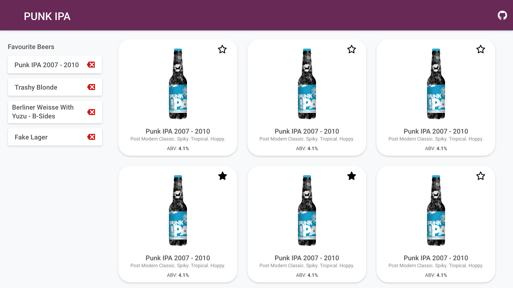
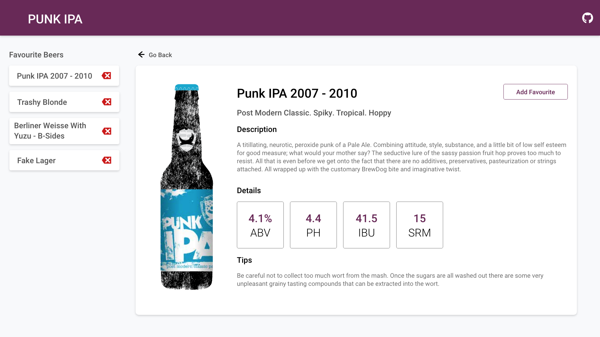

## Project using Punk API to display beers

View deployed site [here](https://overstock-punk.netlify.app)

I did a mockup of what I wanted the design to be before starting. I used Adobe XD for these. Overall the majority of the design stayed the same. I changed some parts to make it more responsive on mobile and added some other details to the details page.

*Main List Page Design*

*Details View Page Design*